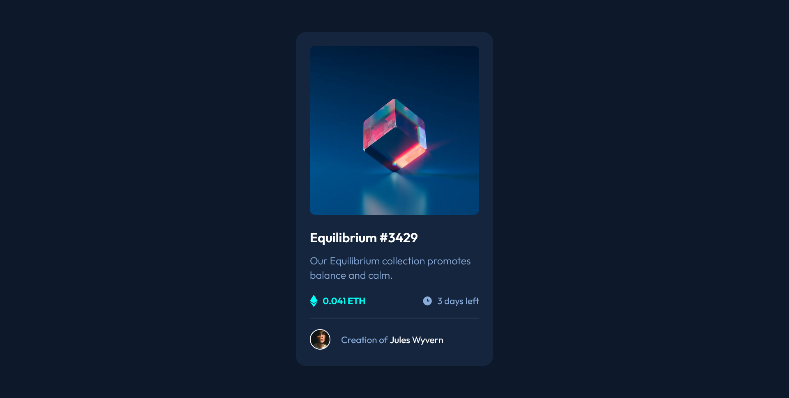

# Frontend Mentor - NFT preview card component solution

This is a solution to the [NFT preview card component challenge on Frontend Mentor](https://www.frontendmentor.io/challenges/nft-preview-card-component-SbdUL_w0U). Frontend Mentor challenges help you improve your coding skills by building realistic projects.

## Table of contents

- [Overview](#overview)
  - [The challenge](#the-challenge)
  - [Screenshot](#screenshot)
  - [Links](#links)
- [My process](#my-process)
  - [Built with](#built-with)
  - [What I learned](#what-i-learned)
- [Author](#author)

## Overview

### The challenge

Users should be able to:

- View the optimal layout depending on their device's screen size
- See hover states for interactive elements

### Screenshot

#### Desktop

#### Mobile

#### Active-Image

#### Active-Heading

#### Active-Name

### Links

- Solution URL: [GitHub](https://github.com/Ibtehaj-Ali-1/NFT-Card)
- Live Site URL: [NFT Card Component](https://nft-card-component-gold.vercel.app/)

## My process

### Built with

- Semantic HTML5 markup
- CSS custom properties
- Flexbox
- CSS Grid
- Mobile-first workflow

### What I learned

- How to create a responsive layout using CSS Flexbox
- How to create hover effects using CSS
- How to use CSS custom properties to make the code more readable and maintainable
- How to use a mobile-first workflow to ensure that the layout is responsive on different devices
- How to use CSS to create a visually appealing design

## Author

- Website - [Ibtehaj Ali Mirza](https://github.com/Ibtehaj-Ali-1)
- Frontend Mentor - [@Ibtehaj-Ali-1](https://www.frontendmentor.io/profile/Ibtehaj-Ali-1)
